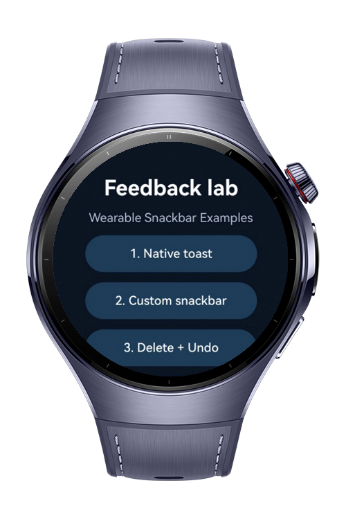
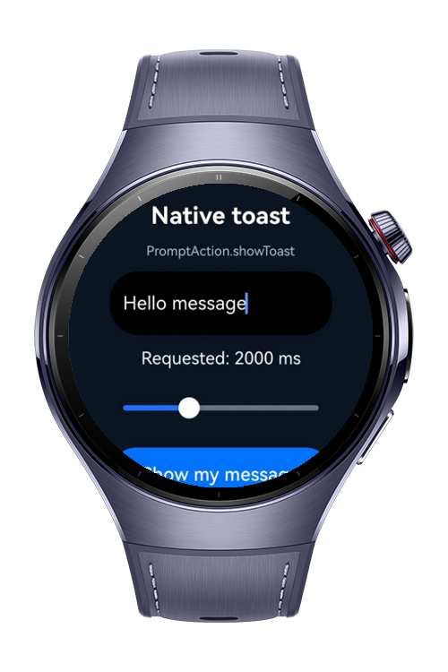
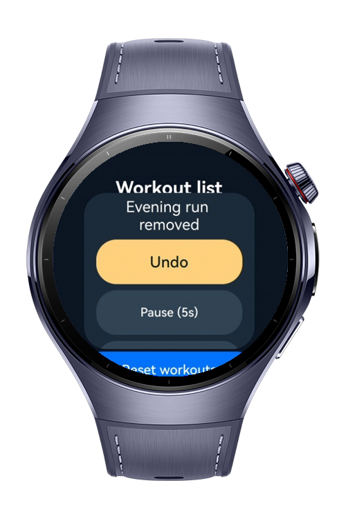
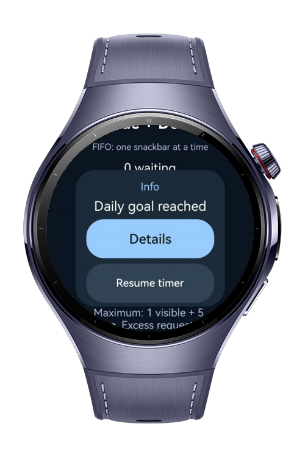

> **Note:** To access all shared projects, get information about environment setup, and view other guides, please visit [Explore-In-HMOS-Wearable Index](https://github.com/Explore-In-HMOS-Wearable/hmos-index).

# How to Show Snackbar in HarmonyOS Wearables

This app is a wearable snackbar reference application that uses `PromptAction.showToast` to display lightweight snackbar-style notifications on HarmonyOS wearable devices. It demonstrates how to show temporary messages, customize message content and display duration, and implement user interaction through custom snackbar components with click handling. The codelab provides practical snackbar patterns optimized for round wearable screens.

# Preview

<div> 
   
   
   
   
</div> 

# Use Cases

* Display a basic snackbar-style notification using `PromptAction.showToast`.
* Customize snackbar message content based on different user actions.
* Configure short and long snackbar display durations.
* Show success, warning, and informational snackbar messages.
* Create a custom snackbar component when additional visual customization is required.
* Add an action button to a custom snackbar and handle user click events.
* Automatically dismiss the custom snackbar after a defined period while allowing manual dismissal through user interaction.

# Technology

## Stack

* **Languages**: ArkTS, ArkUI
* **Frameworks**: HarmonyOS SDK 6.0.1(21)
* **Tools**: DevEco Studio 6.0.1, Hvigor
* **Libraries**:

    * `@kit.ArkUI`
    * `@kit.AbilityKit`

## Snackbar Modules

* `PromptAction.showToast`: Displays lightweight snackbar-style messages without requiring an additional component in the page layout.
* `Toast Duration`: Configures how long the snackbar-style notification remains visible by using supported duration values.
* `Dynamic Messages`: Updates snackbar text according to user actions such as saving, deleting, or completing an operation.
* `Custom Snackbar`: Uses ArkUI components to create a snackbar-style layout when additional styling or interaction is required beyond `showToast`.
* `Snackbar Action`: Adds an interactive action such as Undo, Retry, or Dismiss and handles the click event through an explicitly declared ArkTS callback.
* `Visibility State`: Controls whether the custom snackbar is shown or hidden using component state variables.
* `Auto Dismiss`: Hides the custom snackbar automatically after a configured delay while keeping user-triggered dismissal available.

# Directory Structure

```text
entry/src/main/ets/ 
├─ entryability 
|   ├─ EntryAbility.ets 
├─ components 
|   ├─ CustomSnackbar.ets 
├─ pages 
    ├─ Index.ets 
 
entry/src/main/resources/ 
├─ base 
|   ├─ element 
|   ├─ media 
|   ├─ profile 
```

# Constraints and Restrictions

## Supported Device

* Huawei Watch 5
* DevEco Studio wearable simulator

# License

**How to Show Snackbar in HarmonyOS Wearables** is distributed under the terms of the MIT License. See the [LICENSE](LICENSE) for more information.